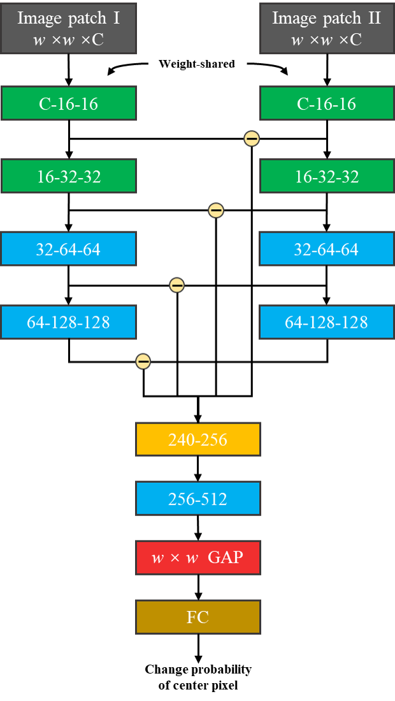
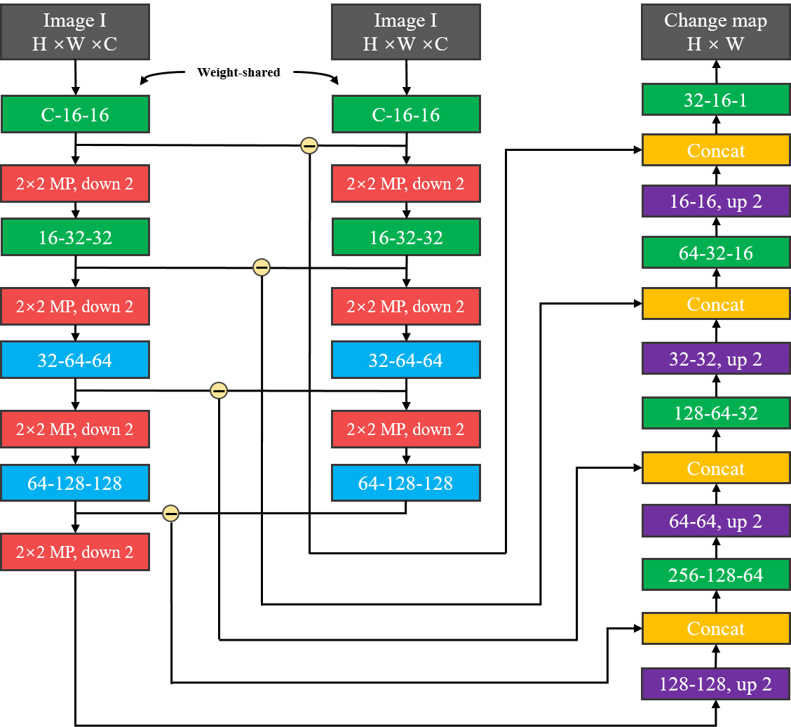
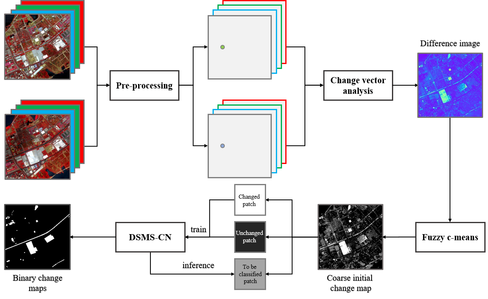
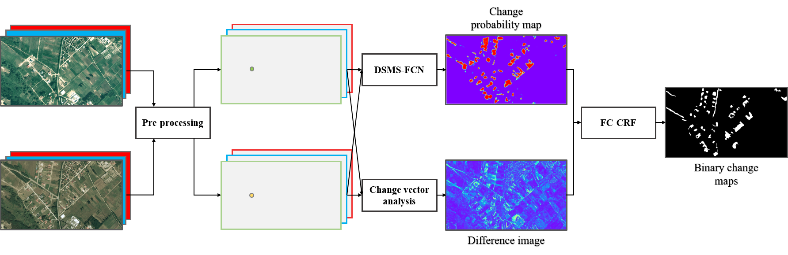

# DSMSCN
Tensorflow implementation for [Change Detection in Multi-temporal VHR Images Based on Deep Siamese Multi-scale Convolutional Neural Networks.](https://arxiv.org/abs/1906.11479)

<div align=center>      </div><p align="center">Left: DSMS-CN, right: DSMS-FCN</p>


## Abstract
Very-high-resolution (VHR) images can provide abundant ground details and spatial geometric information. Change detection in multi-temporal VHR images plays a significant role in urban expansion and area internal change analysis. Nevertheless, traditional change detection methods can neither take full advantage of spatial context information nor cope with the complex internal heterogeneity of VHR images. In this paper, a powerful feature extraction model entitled multi-scale feature convolution unit (MFCU) is adopted for change detection in multi-temporal VHR images. MFCU can extract multi-scale spatial-spectral features in the same layer. Based on the unit two novel deep siamese convolutional neural networks, called as deep siamese multi-scale convolutional network (DSMS-CN) and deep siamese multi-scale fully convolutional network (DSMS-FCN), are designed for unsupervised and supervised change detection, respectively. For unsupervised change detection, an automatic pre-classification is implemented to obtain reliable training samples, then DSMS-CN fits the statistical distribution of changed and unchanged areas from selected training samples through MFCU modules and deep siamese architecture. For supervised change detection, the end-to-end deep fully convolutional network DSMS-FCN is trained in any size of multi-temporal VHR images, and directly outputs the binary change map. In addition, for the purpose of solving the inaccurate localization problem, the fully connected conditional random field (FC-CRF) is combined with DSMS-FCN to refine the results. The experimental results with challenging data sets confirm that the two proposed architectures perform better than the state-of-the-art methods.

## Unsupervised Architecture
<div align=center> </div>


## Supervised Architecture
<div align=center> </div>


## Requirements
```
tensorflow_gpu==1.9.0
keras==2.2.0
opencv==3.1.1
numpy==1.19.1
```

## Citation
Please cite our paper if you use this code in your research.
```
@inproceedings{Chen2019,
author = {Chen, Hongruixuan and Wu, Chen and Du, Bo and Zhang, Liangpei},
booktitle = {2019 10th International Workshop on the Analysis of Multitemporal Remote Sensing Images, MultiTemp 2019},
doi = {10.1109/Multi-Temp.2019.8866947},
eprint = {1906.11479},
isbn = {9781728146157},
pages = {1--4},
title = {{Deep Siamese Multi-scale Convolutional Network for Change Detection in Multi-Temporal VHR Images}},
year = {2019}
}

@article{chen2020change,
title={Change Detection in Multi-temporal VHR Images Based on Deep Siamese Multi-scale Convolutional Networks}, 
author={Hongruixuan Chen and Chen Wu and Bo Du and Liangpei Zhang},
year={2020},
Journal = {arXiv preprint arXiv:1906.11479v2},
}
```

## Q & A
**For any questions, please [contact us.](mailto:Qschrx@gmail.com)**